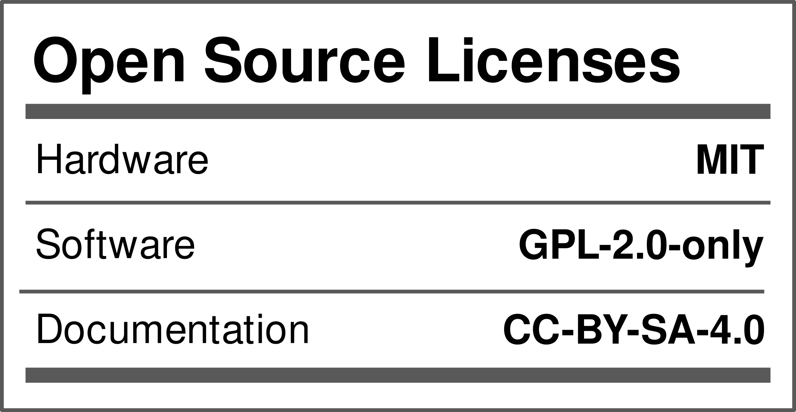

# OtterCastAudioV2

OtterCast is an open-source audio streaming device running Linux.
Based on a Sochip S3 SoC, featuring a Webinterface, shairport-sync, snapcast, Spotify Connect and pulseaudio sink/source.

[Demo Video](https://twitter.com/JanHenrikH/status/1374088494985969667)

## How do I get one?

We are currently planning a small batch production run, stay tuned.

You don't want to wait? You can of course run a small batch on your own! Please have a look into the [production folder](/production_v2.1), a batch size of just 5 (and up to 30) boards is supported by JLC.

## Installation & Configuration

OtterCastAudio can either be configured via the `config.sh` file or via the web-interface.

Check out our [Documentation](https://cast.otter.jetzt/docs/) for more information!

## Schematics?

[Schematics!](/OtterCastAudioV2.pdf)

## Team

 - [@FauthNiklas](https://twitter.com/FauthNiklas) Hardware - OtterCastAmp
 - [@JanHenrikH](https://twitter.com/JanHenrikH) Hardware - OtterCastAudio
 - [@Toble_Miner](https://twitter.com/Toble_Miner) Software - Embedded Linux
 - [@Manawyrm](https://twitter.com/Manawyrm) Software - Frontend & OTA

## What happened to OtterCastAudioV1?

Nobody shall ever know

## Status

HW v2.0 has bugs, ~~v2.1 shall be ordered and tested soon~~, v2.1 works.

 - [x] Audio Line Out
 - [x] Audio Headphone Out
 - [x] Audio In
 - [x] WiFi
 - [x] Ethernet
 - [x] Uart
 - [ ] USB Sound card mode

 - [x] Webinterface (config)
 - [x] Shairport-sync
 - [x] Pulseaudio sink
 - [x] Pulseaudio source
 - [x] snapcast

## License

