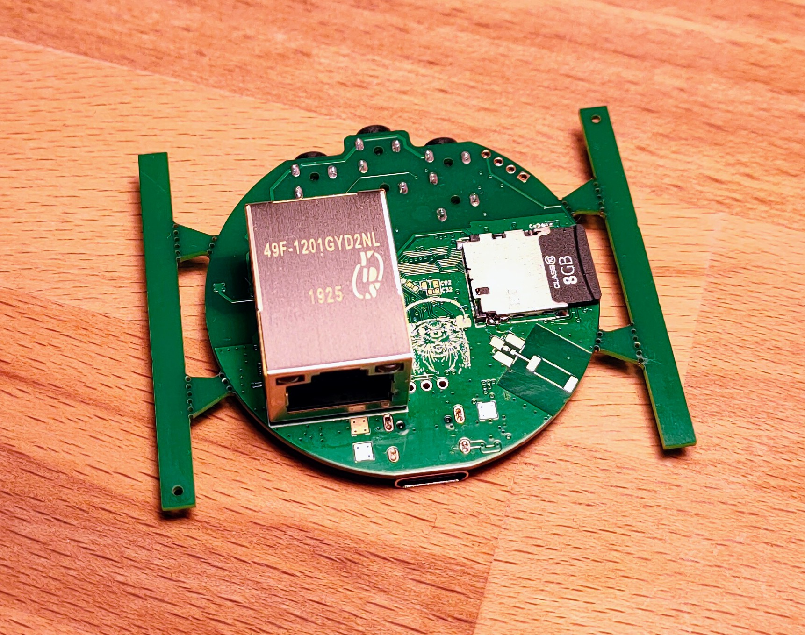
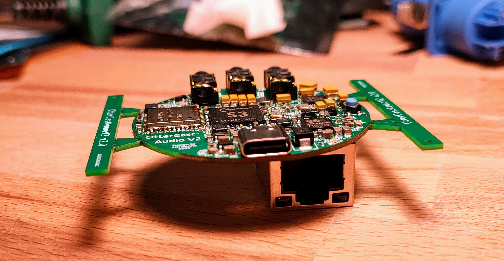

# OtterCastAudioV2

OtterCast is an open-source audio streaming device running Linux.
Based on a Sochip S3 SoC, featuring a Webinterface, shairport-sync, snapcast and pulseaudio sink/source.

##### Note: DO NOT ORDER/PRODUCE - it still got bugs, this note will disappear when fixed.

[Demo](https://twitter.com/Toble_Miner/status/1360255162682638337)

## Team

*Hardware by:*

[@FauthNiklas](https://twitter.com/FauthNiklas)

[@JanHenrikH](https://twitter.com/JanHenrikH)

*Bringup & Linux build & software by:*

[@Toble_Miner](https://twitter.com/Toble_Miner)

[@Manawyrm](https://twitter.com/Manawyrm)

*What happened to OtterCastAudioV1?*

Nobody shall ever know

## Status

HW v2.0 has bugs, v2.1 shall be ordered and tested soon.

 - [x] Audio Line Out
 - [x] Audio Headphone Out
 - [x] Audio In
 - [x] WiFi
 - [x] Ethernet
 - [x] Uart
 - [ ] USB Sound card mode
 
 - [x] Webinterface (config)
 - [x] Shairport-sync
 - [x] Pulseaudio sink
 - [x] Pulseaudio source
 - [x] snapcast

## Images

